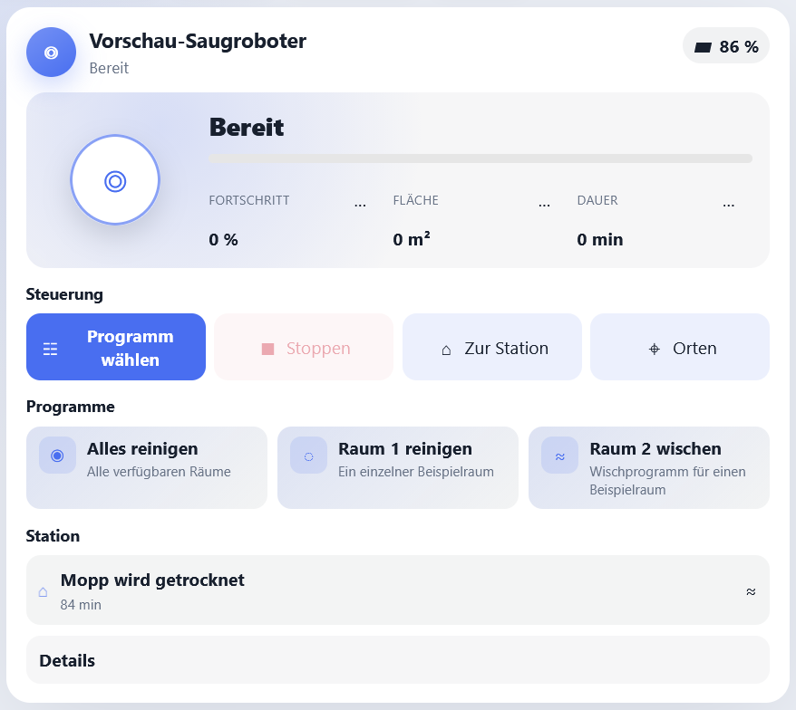
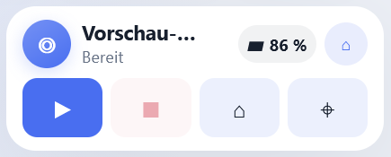
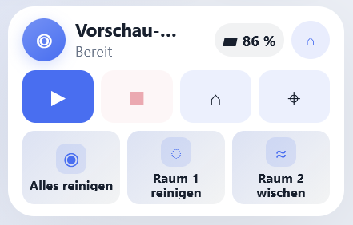

# Vacuum Control Card

[**Deutsch**](./README.md) | [English](./README_EN.md)

Eine übersichtliche Home-Assistant-Karte für Saug- und Wischroboter. Sie zeigt den aktuellen Zustand, wichtige Reinigungswerte, eigene Reinigungsprogramme und – falls vorhanden – die Station.



Die Karte ist nicht an einen bestimmten Hersteller gebunden. Als Basis wird lediglich eine `vacuum`-Entität in Home Assistant benötigt. Zusätzliche Funktionen hängen davon ab, welche Entitäten die jeweilige Integration bereitstellt.

## Funktionen

- reduzierter Standard mit Status, Batterie und den wichtigsten Aktionen
- schlanke Anzeige der aktuellen oder letzten Reinigung mit animiertem Roboter
- Start, Pause, Stopp und Rückkehr zur Station
- eigene Reinigungsprogramme mit sicherer Bestätigung vor jedem Start
- echte kompakte Darstellung für kleine Dashboard-Kacheln
- frei wählbare Übersichtswerte, Hinweise und sichtbare Kartenbereiche
- kombinierte Ansicht, reine Roboteransicht oder eigene Stationsansicht
- optionale Karte, Reinigungsmodi, Wischstärke und Lautstärke
- Stationszustände, Tankhinweise und Mopp-Trocknung
- frei konfigurierbare Wartungsanzeigen
- dezente Statusanimationen mit Rücksicht auf reduzierte Bewegung
- zwei moderne Designvarianten passend zum eigenen Home-Assistant-Theme
- visueller Karteneditor in Home Assistant
- deutsche und englische Oberfläche

## Vorschau

| Kompakt | Kompakt mit Programmen |
| --- | --- |
|  |  |

## Unterstützte Geräte

Die Grundfunktionen können mit jedem Saug- oder Wischroboter verwendet werden, dessen Home-Assistant-Integration eine `vacuum.*`-Entität und die üblichen Vacuum-Funktionen bereitstellt.

Optionale Anzeigen wie Fortschritt, Karte, Wischmodus, Tanks oder Dockaktivitäten werden nur eingeblendet, wenn passende Entitäten konfiguriert sind. Reinigungsprogramme lassen sich direkt hinzufügen, wenn die verwendete Integration dafür passende Button-Entitäten bereitstellt.

Roborock dient lediglich als herstellerspezifisches Konfigurationsbeispiel.

## Installation mit HACS

Solange die Karte noch nicht im Standardkatalog von HACS enthalten ist:

1. HACS in Home Assistant öffnen.
2. Oben rechts **Benutzerdefinierte Repositories** auswählen.
3. Die URL dieses GitHub-Repositories eintragen.
4. Als Kategorie **Dashboard** auswählen.
5. **Vacuum Control Card** installieren.
6. Home Assistant beziehungsweise den Browser neu laden.

## Manuelle Installation

1. `dist/vacuum-control-card.js` aus diesem Repository herunterladen.
2. Die Datei nach `/config/www/vacuum-control-card.js` kopieren.
3. In Home Assistant **Einstellungen → Dashboards → Ressourcen** öffnen.
4. `/local/vacuum-control-card.js` als **JavaScript-Modul** hinzufügen.
5. Home Assistant beziehungsweise den Browser neu laden.

## Karte hinzufügen

1. Ein Dashboard bearbeiten.
2. **Karte hinzufügen** wählen.
3. Nach **Vacuum Control Card** suchen.
4. Die `vacuum`-Entität des Roboters auswählen.
5. Gewünschte Zusatzentitäten und Programme im visuellen Editor ergänzen.

Alternativ genügt als minimale YAML-Konfiguration:

```yaml
type: custom:vacuum-control-card
entity: vacuum.my_robot
```

## Reinigungsprogramme

Eigene Routinen können als Button-Entitäten hinzugefügt werden. Ein Antippen der Programmkachel startet die Reinigung nicht sofort: Zuerst erscheint immer eine Bestätigung mit dem Namen des Programms und des Zielroboters.

Programme werden bequem im visuellen Karteneditor ausgewählt, benannt und einer Reinigungsart zugeordnet.

## Ansichten

- **Kombiniert:** einfacher Roboterbereich und eine einzelne aufklappbare Stationszeile
- **Nur Roboter:** auf die Robotersteuerung reduzierte Karte
- **Nur Station:** umfangreichere Stationskarte mit Stations-, Wartungs- und Diagnosebereichen

Die Ansicht kann direkt im visuellen Editor gewählt werden. Der Editor blendet danach nur noch Einstellungen ein, die für diese Ansicht und die aktivierten Bereiche relevant sind.

## Erscheinungsbild

Standardmäßig verwendet die Karte **Adaptiv**. Diese Variante übernimmt Farben und Dark Mode aus dem aktiven Home-Assistant-Theme. Neutrale Flächen und feine Konturen fügen sich ruhig in bestehende Dashboards ein; Akzentfarben kennzeichnen vor allem aktuelle Zustände.

Wer die Karte stärker hervorheben möchte, kann im visuellen Editor **Akzent** wählen. Diese Variante behält den moderneren, ausdrucksstärkeren Verlauf und deutlichere Farbakzente bei. Die Auswahl verändert nur das Aussehen – Inhalte, Kartengröße und Sicherheitsabfragen bleiben gleich.

In YAML kann die Variante optional so gewählt werden:

```yaml
appearance: adaptive  # alternativ: accent
```

## Kompakte Karte und Größe

Für Übersichten mit vielen kleinen Karten steht die Dichte **Kompakt** zur Verfügung. Name und aktueller Status bleiben dabei immer sichtbar. Als platzsparender Standard wird zusätzlich die Batterie gezeigt. Im visuellen Editor lässt sich einzeln auswählen, ob Batterie, Fortschritt, gereinigte Fläche und Reinigungsdauer erscheinen sollen. Dort können auch die übrigen Kartenbereiche ein- oder ausgeblendet werden.

In einem Sections-Dashboard startet die kompakte Karte bei einer Mindestgröße von 6 × 2 Feldern. Bei den anderen Darstellungen passt die Karte ihre Mindestbreite und -höhe an die ausgewählten Informationen, Programme und Bereiche an, damit Texte und Bedienelemente lesbar bleiben. Größer ziehen lässt sie sich in Home Assistant weiterhin jederzeit.

## Sprache

Die Karte und ihr visueller Editor übernehmen automatisch die in Home Assistant eingestellte Profilsprache. Bei Deutsch erscheint die Oberfläche auf Deutsch, bei allen anderen Sprachen auf Englisch. Eine eigene Spracheinstellung innerhalb der Karte ist nicht erforderlich.

Entitätsnamen, Zustände und Auswahlwerte werden von Home Assistant beziehungsweise der jeweiligen Geräteintegration geliefert und können deshalb deren Sprache verwenden.

## Beispiele

- [Allgemeines Beispiel](./examples/generic-vacuum.yaml)
- [Roborock](./examples/roborock.yaml)

Entity-IDs unterscheiden sich je nach Hersteller, Integration und eigener Benennung. Nicht vorhandene optionale Entitäten können einfach weggelassen werden.
